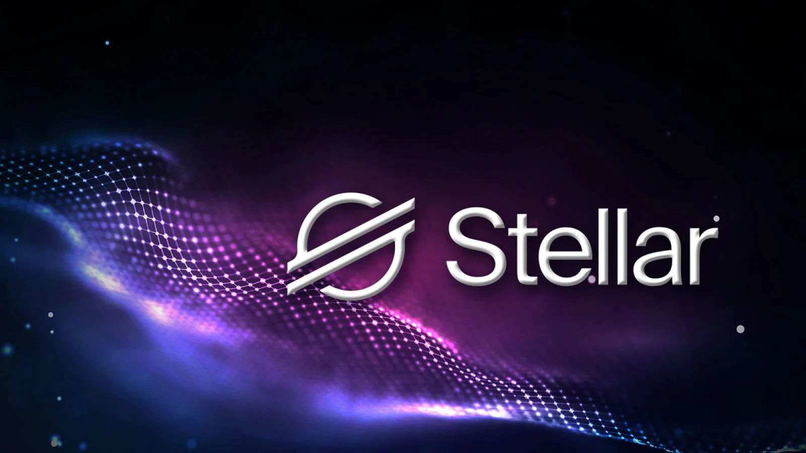
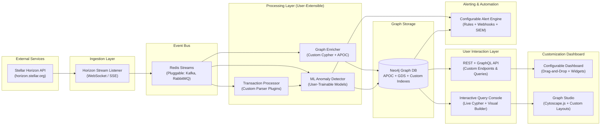

# StellarChainAnalysis – Customizable Graph-Powered Threat Intelligence Platform for Stellar Blockchain



**StellarChainAnalysis** is a **highly customizable, modular, and user-configurable** blockchain analytics and threat intelligence platform for the **Stellar Network**. It ingests raw on-chain data, builds a **dynamic, queryable graph model**, and empowers users to **interact with, extend, and personalize the resulting graph** based on their specific use case — whether security, compliance, research, or business intelligence.

Unlike rigid tools, StellarChainAnalysis is designed as a **flexible infrastructure**:  
- Users can **define custom node types, relationships, and properties**  
- **Create personalized risk models** using configurable rules and ML pipelines  
- **Interact directly with the graph** via APIs, visual queries, or embedded dashboards  
- **Export, extend, or integrate** the graph into external systems (BI tools, SIEM, notebooks)

Built for **security teams, auditors, researchers, and enterprises**, it supports **mass customization** — enabling each deployment to evolve into a **tailored on-chain intelligence engine**.

## Project Vision

To create a **trusted, scalable, and extensible security operations platform** that empowers the Stellar ecosystem with proactive threat intelligence, forensic capabilities, and transparent risk assessment.

## Core Objectives

- **Enable users to define and detect** any custom transaction pattern in real time using **configurable rules, Cypher queries, or ML models**  
- **Allow full control over graph enrichment** — users can **add custom node types, properties, relationships, and enrichment pipelines** to model domain-specific logic  
- **Support dynamic, user-defined risk scoring** — combine built-in heuristics with **custom formulas, external signals, or trained models**  
- **Provide deep, interactive graph exploration** — users can **query, filter, traverse, and manipulate the live graph** through visual tools or direct API access  
- **Deliver fully configurable alerting** — route alerts based on **user-defined thresholds, channels, and enrichment context** (Slack, email, SIEM, webhooks)  
- **Empower advanced forensic workflows** — with **custom graph snapshots, time-travel queries, export formats, and integration hooks** for Jupyter, BI tools, or internal platforms


## Architecture (C4 Model – Container Diagram)


## Data Model – Graph-First Design

StellarChainAnalysis treats the blockchain as a **living, user-extensible graph** — not a fixed schema. While it starts with a minimal core model for Stellar transactions, **every aspect of the graph is designed for mass customization and direct user interaction**.

### Core Model (Starting Point)
- **Accounts** – Public keys with balance and activity metadata  
- **Transactions** – Ledger operations with fee, sequence, and result  
- **Assets** – XLM or custom tokens involved in payments  

### User-Defined Extensions
Users can **freely extend** the graph at runtime:
- Add **custom node types** (e.g., `SuspiciousCluster`, `ComplianceTag`, `UserProfile`)  
- Define **new relationship types** (e.g., `FLAGGED_BY`, `LINKED_VIA_MEMO`, `PART_OF_CAMPAIGN`)  
- Attach **arbitrary properties** (e.g., `kyc_status`, `risk_source`, `user_notes`)  
- Create **virtual nodes/edges** via Cypher projections for analysis  

### Live Graph Interaction
Through the **Graph Studio** and **Query Console**, users can:
- **Traverse** the graph with custom Cypher queries  
- **Merge, split, or relabel** nodes in real time  
- **Create persistent views** (e.g., "All accounts linked to address X in last 7 days")  
- **Export subgraphs** in JSON, CSV, or GEXF for external tools  

> The graph is **not just storage** — it's a **collaborative workspace** where analysts, compliance officers, and data scientists build and refine intelligence together.

## Threat Detection Capabilities

StellarChainAnalysis identifies a wide range of malicious or suspicious behaviors:

| Threat Type | Detection Method |
|-----------|------------------|
| **Money Laundering** | Cycle detection in payment paths |
| **Pump & Dump** | Sudden volume surges + rapid sell-off |
| **Wash Trading** | Self-referential transaction loops |
| **Account Takeover** | Anomalous login or signing patterns |
| **Phishing Drains** | Outbound flows to known malicious sinks |
| **Memo Abuse** | Encoded commands or C2 communication |

Each detection contributes to a **dynamic risk score** (0–100) updated in real time.

## Real-Time Dashboard

The web-based dashboard delivers an **intuitive, analyst-friendly interface** with:

- **Live Activity Feed** – Chronological view of incoming transactions  
- **Risk Leaderboard** – Top 50 highest-risk accounts with trend indicators  
- **Interactive Network Graph** – Explore transaction flows with zoom, search, and filtering  
- **Heatmap View** – Geographic or cluster-based risk density  
- **Alert Timeline** – Visual log of triggered notifications  

All visualizations update instantly via **WebSocket push technology**.

## Machine Learning Integration

StellarChainAnalysis combines **unsupervised and graph-aware ML models**:

### Anomaly Detection
- **Isolation Forest** on transaction velocity, volume, and counterparty diversity  
- **Autoencoders** for learning normal behavioral embeddings  

### Graph Neural Networks
- Trained on historical subgraphs to predict node-level risk  
- Leverages structural patterns invisible to traditional models  

Models are retrained periodically using labeled datasets and feedback loops.

## API & Integration

The platform exposes a **versioned REST API** for integration with external tools:

### Example Endpoints
- `GET /api/v1/accounts/{address}` → Full profile, risk score, and recent activity  
- `GET /api/v1/transactions/{hash}` → Transaction details + local graph context  
- `GET /api/v1/alerts?since=24h` → Recent high-risk events  
- `GET /api/v1/export/graph?center={address}&depth=2` → Export ego-network in JSON  

All responses follow **OpenAPI 3.0** specification.

## Deployment & Operations

StellarChainAnalysis is fully **containerized** and designed for both development and production:

### Local Development
- Uses **Docker Compose** to spin up Neo4j, Redis, and the application  
- Pre-configured datasets for rapid prototyping  

### Production Readiness
- Structured logging (JSON format)  
- Health checks and metrics endpoints  
- Rate limiting and API key authentication  
- Secure configuration via environment variables  
- CI/CD pipeline with automated testing  

Future versions will support **Kubernetes** and **cloud-native observability**.


## Getting Started

### Prerequisites
- Docker & Docker Compose
- Python 3.11+
- Internet access to `horizon.stellar.org`

### Quick Start

1. **Clone the repository**
   ```bash
   git clone https://github.com/yourusername/StellarChainAnalysis.git
   cd StellarChainAnalysis
    ```
2. Copy environment template
   ```bash
   cp .env.example .env
   ```
   
3. Launch services
 ```bash
docker-compose up -d
```

4. Access the platform
    - Dashboard: http://localhost:5000
    - Neo4j Browser: http://localhost:7474
    - API Docs: http://localhost:5000/api/docs

## Testing & Quality

The project includes a comprehensive test suite:
- **Unit tests** for individual components  
- **Integration tests** with live Neo4j containers  
- **End-to-end scenarios** simulating real attack patterns  

All code adheres to **PEP 8** and is validated via **Flake8** and **Black**.

## Security Considerations

- API keys required for all external access  
- Input validation on all public endpoints  
- Secrets never committed to version control  
- Regular dependency scanning (Safety, Bandit)  
- Principle of least privilege in database permissions

## Roadmap

| Version | Milestone |
|--------|----------|
| **v1.0** | Real-time monitoring + basic ML + dashboard |
| **v1.5** | Historical backfill + export tools |
| **v2.0** | FastAPI migration + GraphQL support |
| **v2.5** | Multi-chain connectors (Solana, Ethereum) |
| **v3.0** | Public API + community threat sharing |

## Contributing

We welcome contributions! To get involved:

1. Fork the repository  
2. Create a feature branch (`feature/your-idea`)  
3. Write clean, tested code  
4. Submit a pull request with clear description  

Please follow our **Code of Conduct** and **Contribution Guidelines**.

## Academic & Research Use

This project was originally developed as part of a master's thesis on **Graph-Based Anomaly Detection in Payment Networks**. Supplementary materials:
- Full architecture diagrams  
- Performance benchmarks  
- Model evaluation results  
- Cypher query library  

Available in the `/docs` directory.

## License
MIT License
Copyright (c) 2025 javad torabi
Permission is hereby granted, free of charge, to any person obtaining a copy
of this software and associated documentation files (the "Software"), to deal
in the Software without restriction...


## Contact

**Project Maintainer**  
Email: [j.2528840@gmail.com](mailto:j.2528840@gmail.com)  
GitHub: [@javadTorabiKh](https://github.com/javadTorabiKh)  


> **StellarChainAnalysis** — *Turning blockchain data into defense-grade intelligence.*

---

*Built with precision. Powered by graphs. Secured for the future.*  
**#StellarChainAnalysis #BlockchainSecurity #GraphAnalytics #Web3**

